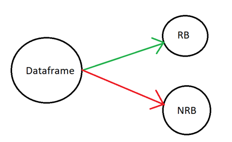
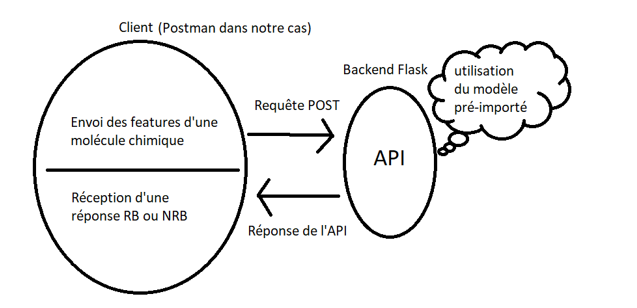

# Python for data analysis

dataset: http://archive.ics.uci.edu/ml/datasets/QSAR+biodegradation

Nous avons un dataset possédant 41 features et 1 target.
Notre dataset est un QSAR.
Le QSAR est une relation quantitative structure à activité,
c'est le procédé par lequel une structure chimique est corrélée avec un effet bien déterminé comme l'activité biologique ou la réactivité chimique. 
Dans notre cas ce dataset montre différentes structures chimiques corrélées avec une classe expérimentale qui reprénte la biodégradabilité de la structure chimique.

## Objectif

Notre objectif est de réaliser un modèle qui nous permettra par la suite de trouver la target (biodégradable ou non) en fonction de la structure de la molécule.
Le tout sera implementé dans une API qui permettra d'émettre des requêtes POST pour envoyer les paramètres de la structure chimique et d'obtenir une réponse sur sa classe experimentale.

### Méthode

La réalisation du modèle est passée par plusieurs étapes.
_ Visualisation des données
_ Modélisation

La visualisation des données a permis d'obtenir de nombreuses informations notamment le fait que certaines variables soient correlées entre elle.
Celle-ci ont par la suite été retirée de façon à obtenir une précision optimale.
On obtient également les résultats nous montrant les variables ayant la plus forte incidence sur le fait que la structure chimique soit biodégradable ou non.

La Modélisation s'est fait sur plusieurs classifieurs de façon à trouver celui ayant l'accuracy la plus élévée. 
Deux classifieurs ont été utilisé: 
_ Knn
_ Random Forest

### Résultats

Les résultats de notre visualisation de données nous permettent d'obtenir les features ayant la plus forte incidence sur la classe experimentale (Ready biodegradable, Not Ready biodegradable).
Résultat:

_C%

_nO

_HyWi_B(m)¶

_SpPosA_B(p)

_SpMax_B(m)

_SM6_B(m)

Sont les variables ayant la plus forte incidence sur notre target.

Les résultats des modélisation nous ont permis de voir que la méthode des random forest était la plus optimale pour notre dataset.
Une Gridsearch et une cross validation ont permis d'obtenir les hyperparamètres ayant la meilleure accuracy pour notre modèle.
C'est donc à l'aide de ces méthodes que nous avons obtenu un modèle se basant sur le classifieur Random Forest ayant les paramètres les plus optimaux.

## API Flask

Une API flask a été réalisée.
J'ai implémenté un endpoints se trouvant à cette adresse localhost:5000/predict
Il n'est accessible qu'en méthode POST et permet d'envoyer les features d'une structure chimique et de recevoir sa classification (RB ou NRB)
Aucun front-end n'a été implementé, de ce fait j'ai utilisé Postman pour effectuer mes requêtes.

